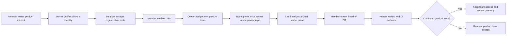

# CHNAI LAB Governance

CHNAI LAB is a student-run product studio. We use AI agents for leverage, but
people retain ownership, judgment, and accountability.

Control in this studio means clear decision rights, least-privilege access,
reviewable evidence, and reversible changes. It does not mean hidden monitoring
or measuring people by activity volume.

## System Of Record

GitHub is the engineering system of record:

- Issues record the problem, accountable human, risk, scope, and definition of
  done.
- Branches isolate one issue from `main`.
- Commits record the implementation history.
- Pull requests connect the issue, change, evidence, review, and rollback.
- CI records repeatable automated checks.
- Reviews record human approval and unresolved concerns.

Dashboards and portals may summarize this state, but they must link back to the
GitHub record. A dashboard entry without an issue or pull request is not proof
that engineering work happened.

## Roles And Decision Rights

| Role | Owns | Must not delegate to an agent |
| --- | --- | --- |
| Organization owner | Membership, billing, visibility, settings, secrets, and final organization decisions | Privileged access and irreversible actions |
| Product lead | Product boundary, priority, issue readiness, and release decision | User need, claim approval, and final product judgment |
| Builder | Implementation, branch hygiene, evidence, and handoff | Understanding the change and personally verifying it |
| Domain reviewer | Security, data, infrastructure, AI, finance, or business review in their domain | Approval responsibility |
| AI agent | Research, implementation, tests, documentation, and analysis within the issue | Human identity, approval, evidence, or accountability |
| CI | Repeatable automated gates | Product judgment or manual verification |

One person may hold several human roles. The pull request must still say who
acted as accountable owner and who reviewed the result.

## Access Lifecycle

Rules:

- Organization base repository permission stays `none`.
- Members receive access through product teams, not direct grants.
- A teammate may join more than one product team after confirming active work,
  but broad access is never the default.
- Outside collaborators are temporary and limited to one repository.
- Access is reviewed when a project ends, a role changes, or a teammate becomes
  inactive.
- Two-factor authentication is required before new product access is granted.

### Product Team Map

GitHub remains the source of truth for current membership. This table defines
the stable team-to-repository boundary only; it does not duplicate member
assignments.

| Team slug | Private repository | Baseline permission |
| --- | --- | --- |
| `bayonhub-builders` | `bayonhub` | Write |
| `chomkar-builders` | `chomkar` | Write |
| `phsaros-builders` | `phsaros` | Write |
| `sat-digital-builders` | `sat-digital` | Write |
| `svaeng-yul-builders` | `svaeng-yul` | Write |
| `vantrex-builders` | `vantrex` | Write |
| `website-builders` | `website` | Write |

Adding a member to a row grants access only to that row's repository. Any
cross-product assignment is a second explicit team decision.

## Decision Routing

| Decision | Accountable human | Required consultation |
| --- | --- | --- |
| Normal product scope | Product lead | Builder and relevant user evidence |
| Architecture inside one repo | Product lead or delegated maintainer | Builder and affected domain reviewer |
| Security, auth, private data, payments, trading, or migrations | Product lead | Relevant domain reviewer |
| Public claims or launch language | Product lead | Person who owns the underlying evidence |
| Membership, repo access, visibility, secrets, production, or billing | Organization owner | Affected product lead and security reviewer when relevant |
| Cross-product standard | Organization owner | Product leads affected by the change |

Meaningful decisions use the decision issue form in the affected repository.
Private context stays in a private repository. The record includes context,
options, consequences, owner, risk, rollback, and a review trigger.

## Merge Authority

A merge requires:

1. A linked issue with an accountable human and definition of done.
2. A focused pull request with AI involvement disclosed.
3. Required repository checks passing.
4. Human verification recorded in the pull request.
5. Review by the relevant owner or CODEOWNER.
6. No unresolved security, data, claim, or public/private boundary concern.

An agent may prepare the merge, but it never acts as the human approver.

## WIP And Focus

The default work-in-progress limit is one active implementation issue per
builder per product. A second item can be active only when the first is blocked
and the issue records the blocker. This keeps ambitious work visible without
turning every idea into an active commitment.

## Current Enforcement Boundary

CHNAI LAB currently uses GitHub Free. Team access, private repositories,
CODEOWNERS, issues, pull requests, and Actions are available. GitHub does not
enforce protected branches for private organization repositories on this plan.

Until an upgrade to GitHub Team:

- The no-direct-push rule is a documented team policy, not a technical block.
- CODEOWNERS requests review but cannot force approval on private repos.
- CI reports failures but cannot prevent a privileged direct push.

Organization owners can review the web audit log, but automated audit-log API
access requires GitHub Enterprise Cloud. Current automated verification must
therefore compare live team, repository, issue, pull request, and CI state; it
must not claim an exported organization audit trail exists.

After an upgrade, every active private product repository should require a pull
request, one approval, resolved conversations, passing required checks, a current
branch, and no force pushes or deletions on `main`.

This limitation must remain visible. We do not describe a social policy as an
enforced control.

## Privacy And Fairness

- Do not publish member email addresses, private chats, availability, academic
  records, or performance notes in public repositories.
- Measure contribution by reviewed outcomes and responsibility, not commit
  count, issue count, or hours online.
- Credit people only for work they materially contributed and approved.
- Record AI help in the pull request; never manufacture co-authorship, reviews,
  or activity for profile metrics or achievements.

## Review Cadence

Organization owners review quarterly:

- Active members and 2FA readiness.
- Product-team membership and stale access.
- Active and archived repositories.
- Repository adoption of the CHNAI LAB standard.
- Unmerged dependency and security updates.
- Exceptions that should be removed or renewed.
