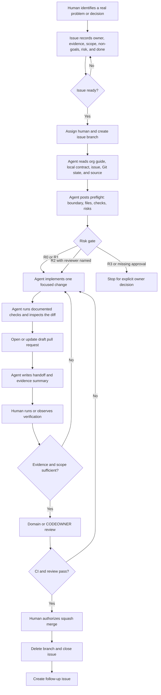
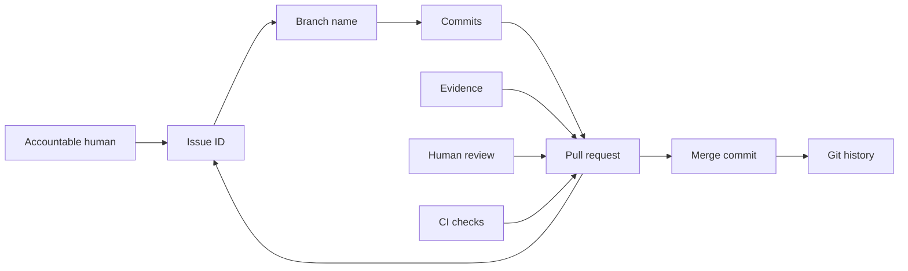
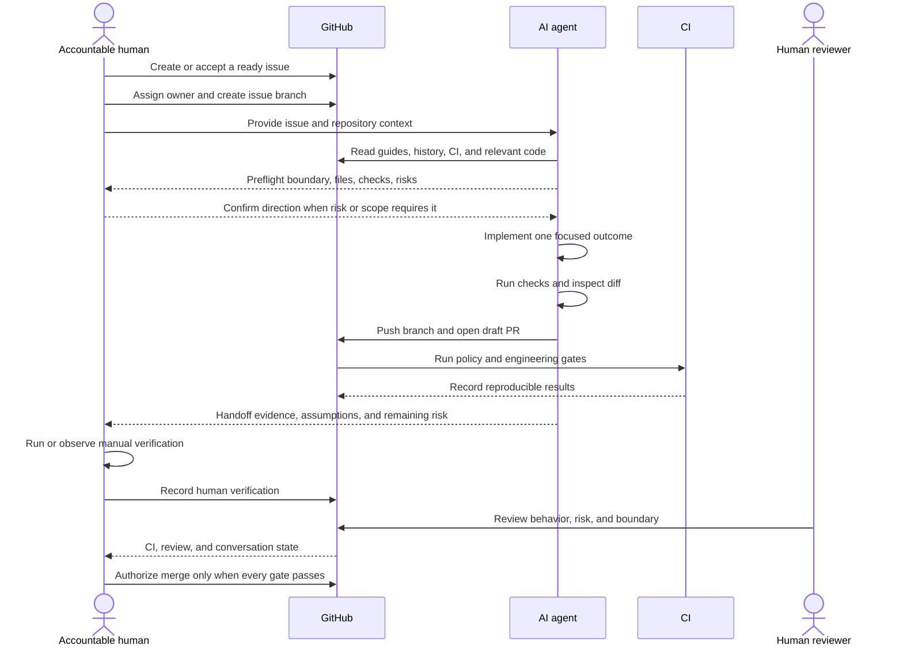
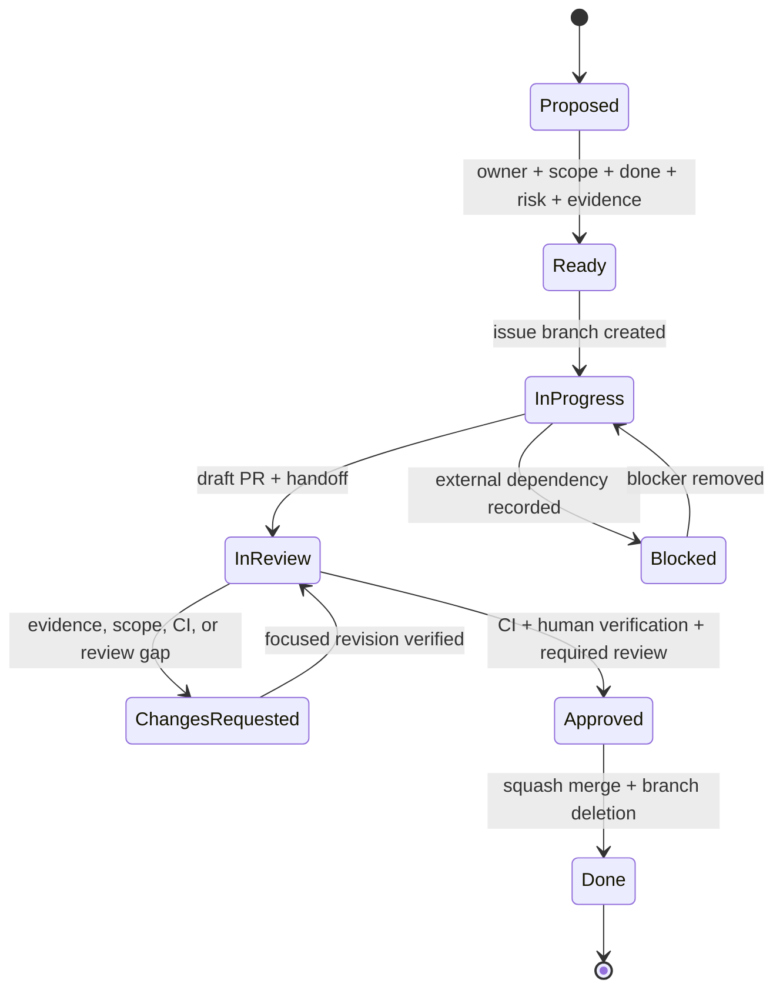

# AI Agent Workflow

CHNAI LAB works AI-native, but never AI-blind. Agents provide speed,
consistency, research, and implementation leverage. Humans provide curiosity,
product judgment, accountability, and the final decision to ship.

This workflow applies to every active repository. A local `AGENTS.md` may add
stricter product rules.

## Invariants

- One issue owns one outcome.
- One accountable human owns the issue.
- One branch owns the issue.
- One pull request owns the reviewable change.
- One evidence packet explains what was proven.
- One human records final verification.
- `main` changes through a reviewed pull request.
- Agents receive context, never secrets.

## Delivery Framework



The loop is intentionally simple: **frame, build, prove, review, ship, learn**.
AI accelerates the middle. It does not own the frame, the proof, or the merge.

## Traceability Chain



Every link is visible from GitHub. A portal may display the chain, but it must
not replace or silently fork it.

## Issue Readiness

An issue is ready only when it has:

- An accountable human.
- A problem or outcome, not only a requested implementation.
- Evidence or an explicitly labeled assumption.
- Scope and non-goals.
- A testable definition of done.
- A verification plan.
- The highest applicable risk tier.
- A safe public/private boundary.

If these are unclear, the first agent task is to ask questions or improve the
issue. It must not hide uncertainty by generating code.

## Session Start Protocol

Before editing, every agent reads in this order:

1. The issue or explicit task.
2. The local repository `AGENTS.md`.
3. The local `README.md`, `CONTRIBUTING.md`, and `SECURITY.md`.
4. Local tool-specific guidance such as `CLAUDE.md` or Copilot instructions.
5. This organization workflow and `docs/REPOSITORY_STANDARD.md`.
6. Package scripts, CI, and the documented verification command.
7. Git status, current branch, recent history, and relevant source files.

The agent then posts a preflight before changing files:

```md
Outcome:
Product boundary:
Risk tier:
Files likely to change:
Checks to run:
Assumptions or unknowns:
Stop conditions:
```

Missing context is reported. It is never replaced with an invented product or
technical fact.

## Risk Gate

Use the highest tier that matches any part of the change.

| Tier | Typical work | Agent authority | Human gate |
| --- | --- | --- | --- |
| R0 | Docs, comments, non-runtime repository policy | Implement and verify on a branch | Owner reviews before merge |
| R1 | Normal reversible product behavior without sensitive data | Implement, test, and open a draft PR | Human manually verifies changed behavior |
| R2 | Auth, authorization, private data, security, payments, financial reporting, trading, migrations, AI claims, production dependencies | Implement only with named domain reviewer and rollback plan | Domain review plus human verification required |
| R3 | Secrets, production access, repository visibility, membership, billing, legal commitments, irreversible data action, live deployment | Analyze and prepare a plan; stop before the privileged action | Explicit organization-owner instruction at the action point |

Risk can increase during implementation. The agent stops and reclassifies the
issue when it discovers a higher-risk surface.

## Human And Agent Sequence



## Branch And Commit Protocol

Branch names include the issue number:

- `feat/<issue>-short-name`
- `fix/<issue>-short-name`
- `docs/<issue>-short-name`
- `chore/<issue>-short-name`

Rules:

- Branch from current `main`.
- Keep one concern per branch.
- Default WIP is one active implementation issue per builder per product.
- Push early when work will continue so it is visible and recoverable.
- Never force-push a shared branch.
- `--force-with-lease` is limited to your own unreviewed PR branch.
- Use Conventional Commit subjects that describe the outcome.
- Use human co-author trailers only for people who materially contributed and
  consented. Record AI help in the pull request instead.

## Work State Machine



Do not represent a state with a label alone. The linked issue, branch, PR, CI,
and review evidence must support it.

## Implementation Loop

The agent:

1. Reads before editing.
2. Chooses the smallest coherent implementation that satisfies the full issue.
3. Preserves unrelated human changes.
4. Uses existing architecture and repository conventions.
5. Adds tests proportional to behavior and risk.
6. Runs the real verification commands.
7. Inspects the final diff for secrets, scope drift, weak claims, and generated
   noise.
8. Reports failures honestly and keeps working when a safe path exists.

The agent does not optimize for a green check by narrowing the requested
outcome or deleting difficult coverage.

## Pull Request Protocol

Open a draft pull request early enough that work is visible. Mark it ready only
after the evidence packet is complete.

Every pull request includes:

- `Closes #<issue>` or an explicit reason it does not close the issue.
- Accountable human and risk tier.
- Outcome and non-goals.
- Files or product surfaces changed.
- Commands run and exact results.
- Manual behavior checked by a human.
- Screenshots or recordings for visible UI changes.
- AI tool and what it contributed.
- What the human reviewed or changed.
- Sensitive context declaration.
- Risks, rollback, and remaining uncertainty.
- Public/private and claim-safety confirmation.

"The agent said it works" is not evidence.

## Evidence Standard

Evidence is matched to the change:

| Change | Minimum evidence |
| --- | --- |
| Documentation or policy | Verifier, syntax/format check, link review, rendered review when layout matters |
| UI | Type/lint/test/build plus human mobile and desktop flow; screenshot when useful |
| API or backend | Unit/integration tests, affected route/function, failure-path check |
| Database migration | Generated client or schema check, migration review, rollback/forward plan, no production execution by an agent |
| Security or auth | Threat boundary, negative tests, domain review, redacted evidence |
| Dependency update | Clean install, audit, tests, build, and lockfile review |
| Public claim | Source or owner approval, exact limitation, and no unsupported implication |

The PR records who performed manual verification. An agent may guide the check;
it may not claim the human observed something they did not observe.

## Review Protocol

Reviewers ask:

- Does the change satisfy the issue rather than a smaller substitute?
- Is the accountable human clear?
- Did the agent follow organization and local rules?
- Is the implementation understandable and maintainable by the team?
- Is evidence appropriate to the risk and blast radius?
- Are failure paths, rollback, and data boundaries covered?
- Are public claims conservative and supported?
- Did any secret, private data, strategy, or production detail enter the diff?
- Is human verification real and specific?

Review comments remain unresolved until the code, evidence, or issue scope
addresses them. Silence is not approval.

## Merge And Rollback

The accountable human authorizes merge only when:

- The issue and PR still match.
- Required checks pass.
- Human verification is recorded.
- Required reviewer or CODEOWNER approved.
- Conversations are resolved.
- Risk and rollback are clear.
- No boundary concern remains.

Use squash merge unless repository history requires another documented method.
Delete the branch after merge. Any discovered follow-up becomes a new issue,
not hidden scope in the merged PR.

Rollback is chosen before merge:

- Revert commit for isolated code or docs.
- Feature flag or configuration rollback for reversible runtime behavior.
- Forward migration for database changes when rollback would lose data.
- Incident procedure and secret rotation for exposure.

## Security Rules

Never give an agent:

- Tokens, passwords, private keys, or recovery codes.
- Customer, buyer, farmer, student, employee, or teammate private data.
- Private chats or personal email addresses not required for the task.
- Production database contents or infrastructure credentials.
- Payment, trading, or unreleased product strategy.

Use redacted logs, placeholder environment values, synthetic fixtures, and the
minimum reproduction context. Stop immediately if sensitive data appears.

## Stop Conditions

The agent stops before:

- Changing production, billing, visibility, membership, repository settings,
  secrets, or privileged access without explicit owner instruction.
- Publishing private source, strategy, research, or user data.
- Making legal, security, financial, safety, compliance, certification,
  customer, revenue, or impact claims without verified evidence.
- Running a destructive or irreversible data operation.
- Expanding beyond the issue without a new issue or explicit scope decision.
- Pretending a manual check, review, approval, or external result happened.

## Handoff Template

```md
Issue:
Branch:
Commit:
Outcome delivered:
Files or surfaces changed:
Automated verification:
Manual verification still required:
AI contribution:
Human decisions or changes:
Risks and assumptions:
Rollback:
Sensitive context used: none
Next step:
```

## Standard Agent Prompt

```text
You are working in a CHNAI LAB repository. Read the issue first, then AGENTS.md,
README.md, CONTRIBUTING.md, SECURITY.md, any CLAUDE.md or tool instructions,
the organization AI agent workflow, package scripts, CI, Git status, and the
relevant source. Before editing, report the outcome, product boundary, risk
tier, files likely to change, checks, assumptions, and stop conditions. Never
use secrets or private data. Work on the issue branch, preserve unrelated human
changes, deliver the full definition of done, run real verification, inspect
the diff, and prepare a draft PR handoff that separates AI work from human
verification. Do not merge or perform an R3 action without explicit human
authorization.
```
