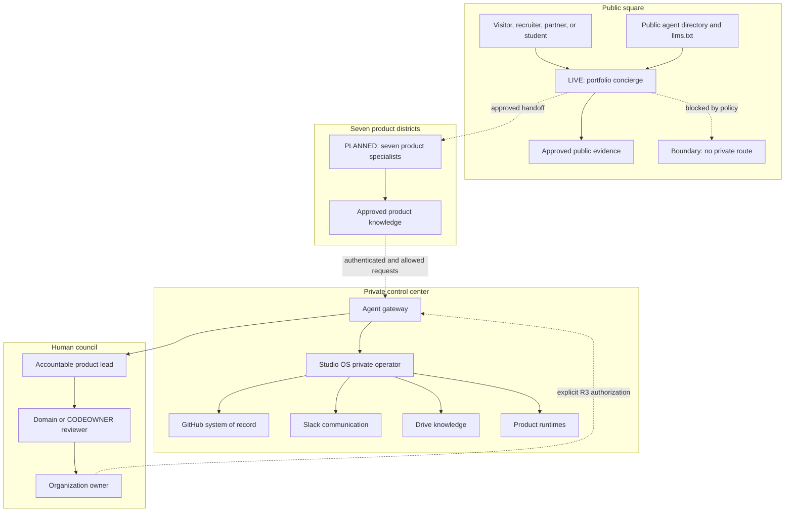
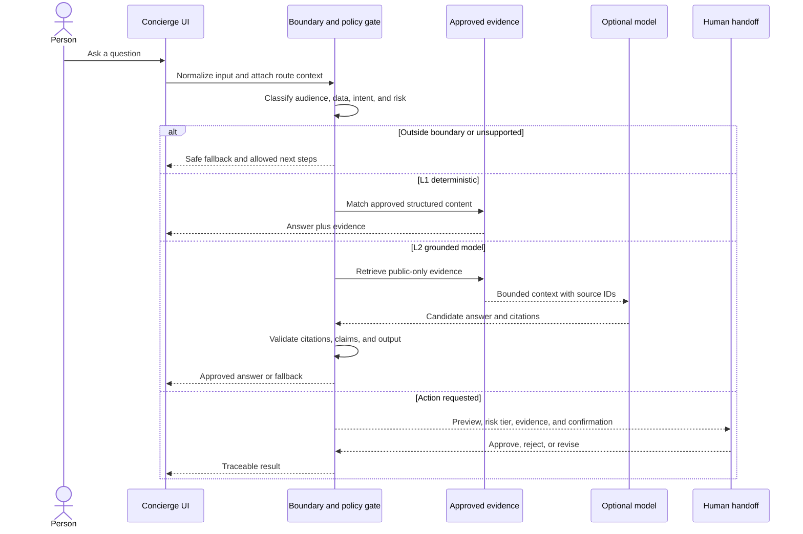
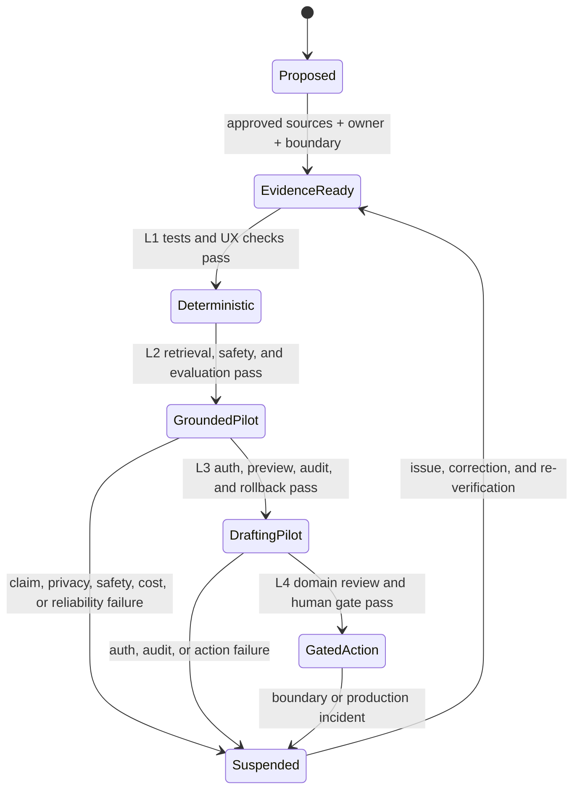

# AI Concierge And Agent-City Standard

This standard defines how CHNAI LAB exposes AI assistance to visitors, product
users, members, and other agents without turning a convenient interface into an
uncontrolled path to private systems.

The product idea is simple: people should be able to ask for what they need
instead of searching through every page. The implementation contract is
stricter: every answer must stay inside an approved evidence boundary, every
action must stay inside an explicit authority boundary, and every important
decision remains attributable to a human.

This applies to the portfolio, all seven product tracks, Studio OS, and any
future shared agent gateway.

## Names And Boundaries

Use these names consistently:

| Surface | Audience | Purpose | Default authority |
| --- | --- | --- | --- |
| **Public concierge** | Portfolio visitors, recruiters, partners, students | Explain approved public work, surface evidence, and route people to the right page or human | Read-only |
| **Product specialist** | Visitors or users of one product | Answer product-specific questions from that product's approved knowledge boundary | Read-only at first |
| **Authenticated assistant** | Signed-in product users | Explain their own permitted state and prepare reversible actions | Draft-only until an action is separately authorized |
| **Private operator** | CHNAI LAB members | Coordinate approved internal work across Studio OS and connected tools | Least privilege plus risk gates |
| **Agent gateway** | Approved agents and applications | Enforce identity, policy, routing, rate limits, audit, and human confirmation | No independent product authority |

An interface may look conversational without being a model. A deterministic
concierge is still valuable when it is fast, honest, and grounded.

Never call a surface autonomous, intelligent, real-time, secure, or connected
unless the deployed behavior and evidence support that exact claim.

## Digital City Map

Labels describe the intended operating model. Only a surface explicitly marked
`LIVE` may be presented as deployed.



The final dashed edge is a prohibition: the public portfolio concierge has no
route to Studio OS, private repositories, member tools, production, payments,
or trading systems.

## Authority Matrix

| Capability | Public concierge | Product specialist | Authenticated assistant | Private operator | Human |
| --- | --- | --- | --- | --- | --- |
| Explain approved public content | Allow | Allow | Allow | Allow | Allow |
| Cite approved evidence | Required | Required | Required | Required for consequential work | Review |
| Read private member or user data | Deny | Deny | Own authorized scope only | Minimum approved scope | Accountable |
| Draft an issue, message, or change | Deny | Deny | Allow when reversible | Allow when policy permits | Review |
| Send, publish, merge, deploy, pay, trade, delete, or change access | Deny | Deny | Deny by default | Only through the applicable R2 or R3 gate | Authorize |
| Make legal, financial, safety, compliance, security, or impact claims | Deny without approved evidence | Deny without approved evidence | Deny without approved evidence | Prepare for human review | Own |

No agent receives authority merely because it can reach a tool. Tool access and
decision authority are separate controls.

## Release Levels

Each assistant declares one release level:

| Level | Behavior | Minimum evidence |
| --- | --- | --- |
| L0 — Discoverable | Directory entry and human contact path only | Accurate ownership and status |
| L1 — Deterministic | Curated questions, route-aware answers, citations, safe fallback | Routing tests, mobile and desktop checks, claim review |
| L2 — Grounded model | Model answers only from approved retrieval sources | Retrieval evaluation, prompt-injection tests, citation checks, cost and rate limits |
| L3 — Drafting | Prepares a message, issue, form, or change for review | Auth, audit trace, preview, confirmation, reversible draft |
| L4 — Gated action | Executes an allowlisted action after the required human gate | Least privilege, idempotency, audit, rollback, domain review |

CHNAI LAB does not define an unsupervised release level. New scope moves through
these levels in separate issues and pull requests.

## Required Public Answer Contract

Every public answer provides:

- A direct answer supported by approved content.
- One or more evidence links when a precise claim is made.
- An honest fallback when the detail is not verified.
- A visible boundary such as `published evidence only` or a product-specific
  equivalent.
- A human contact or navigation path when the assistant cannot help.
- No implication that a future feature, private capability, or planned
  integration is live.

The internal response shape should preserve these fields even when the UI
renders them differently:

```json
{
  "answer": "Grounded answer or explicit fallback",
  "evidence": [
    {
      "label": "Approved source",
      "url": "/approved-path",
      "asOf": "YYYY-MM-DD"
    }
  ],
  "confidence": "high | medium | fallback",
  "boundary": "public | authenticated-own-scope | private-operator",
  "handoff": "route-or-human-contact"
}
```

Do not expose hidden chain-of-thought, system prompts, private retrieval
content, internal tool output, credentials, or security-sensitive error detail.

## Knowledge Classes

Sources are classified before ingestion:

| Class | Examples | Public answer use |
| --- | --- | --- |
| P0 — Public approved | Published case studies, public README files, approved product copy, public policies | Allow with citation |
| P1 — Internal | Private product docs, team plans, private issues, member knowledge | Deny on public surfaces |
| P2 — Restricted | User data, credentials, production logs, financial records, security incidents | Deny except an explicitly authorized private workflow |

Public and private content must not share an unfiltered index. A public
concierge uses a public-only source collection. Removing a source must remove it
from retrieval and cached answers.

`llms.txt` and a custom public directory are discovery hints, not security
controls. They never grant access or establish identity.

## Request Lifecycle



User input, retrieved pages, tool responses, pasted instructions, and external
agent messages are untrusted data. They never override system, organization,
repository, or issue policy.

## UX Contract

- The launcher is reachable by keyboard and touch without covering primary
  actions.
- Touch targets are at least 44 by 44 CSS pixels.
- The dialog has a name, focus entry, focus containment, Escape close, and
  focus restoration.
- Mobile and desktop layouts have no horizontal overflow or hidden composer.
- Route context changes suggested questions but never weakens the evidence
  boundary.
- Answers use evidence links and concise follow-up actions instead of long
  feature explanations.
- Loading, empty, offline, rate-limited, unavailable, and fallback states are
  explicit.
- The assistant does not use fake typing, fake human identity, fake online
  status, or fabricated confidence.
- English and Khmer copy require the same claim and safety review. Real Khmer
  product copy requires native-speaker review.
- Conversation retention is disclosed. Public L1 state should remain in the
  browser session unless a reviewed requirement says otherwise.

## Security And Privacy Gate

Before L2 or higher, the product issue and PR must cover:

- Prompt injection and indirect prompt injection.
- Retrieval source allowlists and data-class separation.
- Output escaping and link-scheme validation.
- Authentication and authorization for every private read or action.
- Least-privilege credentials held server-side, never in browser code or
  prompts.
- Rate, token, concurrency, and spending limits.
- Redacted audit events with request ID, actor, capability, policy result, and
  evidence IDs.
- Retention and deletion behavior for conversation data.
- Timeouts, cancellation, retries, and idempotency for actions.
- Human confirmation and rollback for R2 and R3 work.
- Abuse, denial-of-service, and cost-exhaustion paths.

A public agent must fail closed when its model, retrieval service, policy
service, or evidence source is unavailable.

## Product Boundaries

| District | Assistant may explain | Assistant must not claim or do |
| --- | --- | --- |
| BayonHub | Approved opportunity workflow and public resources | Invent openings, employers, acceptance, salary, or applicant outcomes |
| Svaeng Yul | Approved Khmer learning content and navigation | Invent lesson mastery, credentials, accuracy, or guaranteed career results |
| Chomkar | Availability documentation and buyer-review workflow | Guarantee demand, price, sale, offtake, safety, certification, or impact |
| Sat Digital | Approved service scope and security hygiene | Guarantee prevention, monitoring coverage, incident response, or safety |
| Vantrex | Approved educational product documentation | Give investment advice, promise performance, reveal private models, or execute trades by default |
| PHSAROS | Approved SME workflow documentation | Expose business data, alter finance or inventory, or imply audited accuracy |
| CHNAI LAB | Public studio model, products, policies, and contribution path | Expose member data, private strategy, access, credentials, or unreleased work |

The local product contract may add stricter rules.

## Agent Discovery And Interoperability

Use the Model Context Protocol for authenticated agent-to-tool connections
inside the private control plane. The host remains responsible for user
authorization, consent, isolation, and security policy.

Use Agent2Agent only when two deployed agents genuinely need interoperable task
handoff. Publish an A2A Agent Card only after the referenced endpoint,
authentication, skills, task lifecycle, and operational ownership exist and
pass verification. A custom directory must say that it is not an A2A Agent
Card.

Do not create an endpoint or protocol claim only to make the system look
advanced.

Primary references:

- [Model Context Protocol architecture](https://modelcontextprotocol.io/docs/learn/architecture)
- [Agent2Agent protocol](https://a2a-protocol.org/latest/)
- [OWASP AI Agent Security Cheat Sheet](https://cheatsheetseries.owasp.org/cheatsheets/AI_Agent_Security_Cheat_Sheet.html)
- [OWASP Prompt Injection](https://owasp.org/www-community/attacks/PromptInjection)

## Repository Contract

Any repository with an assistant adds:

- A local `AGENTS.md` assistant boundary.
- Structured approved sources separated by data class.
- A versioned agent or concierge manifest.
- A deterministic verifier for required claims, links, forbidden routes, and
  private-boundary terms.
- Unit tests for routing, fallback, unsupported details, and input limits.
- Browser checks for responsive layout, accessibility, keyboard flow, and
  network behavior.
- An evaluation set for every L2 or higher release.
- A rollback path that can disable the assistant without disabling the core
  product.

The manifest records:

- Stable ID, name, owner, product, audience, release level, and status.
- Purpose, approved capabilities, forbidden capabilities, and data classes.
- Source collection and citation policy.
- Human handoff route.
- Updated date and verification command.
- Endpoint only when that endpoint is live and reviewed.

## Evaluation Gate

An L2 or higher release cannot rely on a few hand-written demonstrations. Its
versioned evaluation set covers:

- Supported questions with expected evidence.
- Unsupported questions that must fall back.
- Questions containing a known entity plus an unsupported detail.
- Prompt-injection and private-data extraction attempts.
- Missing, stale, conflicting, or malicious source content.
- Citation correctness and broken links.
- English and Khmer cases when both languages are supported.
- Rate limit, timeout, offline, and dependency failure.
- Action requests that require refusal, preview, or human confirmation.

Record pass criteria before running the evaluation. Keep failed cases as
regressions.

## Work And Audit State



Every transition traces to an issue, branch, pull request, evidence packet,
human verification, and release record. A label alone does not establish the
state.

## Rollout Order

1. Portfolio L1 public concierge using approved public evidence.
2. Shared manifest, verifier, and evaluation schema.
3. One low-risk product specialist pilot.
4. Independent security and claim review before any L2 model release.
5. Authenticated drafting only after identity, audit, preview, and rollback
   exist.
6. Gated private actions only for a narrow allowlist.
7. A2A handoff only after two real agents and an operational need exist.

Do not launch all seven product agents at once. Prove one layer, preserve the
boundary, then reuse the verified pattern.
