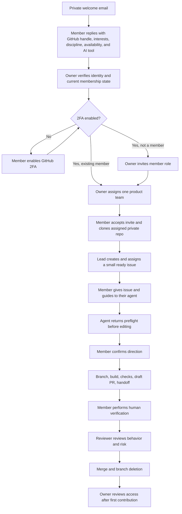

# Member Onboarding

This path lets a new CHNAI LAB teammate choose meaningful work, grant their AI
agent the right context, and produce a traceable first contribution without
receiving broad access or private coaching.

## Onboarding Path



## Information To Collect Privately

The welcome email asks the member to reply with:

1. GitHub username.
2. First and second product choice.
3. Contribution area: product engineering, AI/ML, security, infrastructure,
   design, research, business, or another clearly stated area.
4. One problem in that product they are curious about.
5. Realistic weekly availability.
6. AI agent or coding tool they plan to use.
7. Any accessibility or schedule constraint the lead should respect.

Do not collect passwords, identity documents, recovery codes, private keys, or
unnecessary personal data in an issue.

## Owner Checklist

- Verify the exact GitHub username from the member, not by guessing from a
  display name.
- Check active membership and pending invitations before sending a new invite.
- Invite as `member`, never `owner`, unless an explicit governance decision says
  otherwise.
- Confirm 2FA before product access.
- Add the member to the smallest product team matching active work.
- Do not grant all private repositories by default.
- Confirm the team grants `write`, not `admin`.
- Create a ready starter issue in the selected private product repository.
- Assign one accountable lead or reviewer.
- Send links to the organization guide and local repository contract.
- Review access after the first PR and at least quarterly.

## Member Checklist

1. Accept the CHNAI LAB organization invitation.
2. Enable GitHub two-factor authentication and store recovery codes privately.
3. Enable GitHub's private-email and email-exposure blocking settings.
4. Configure Git to use your GitHub-provided no-reply address or an
   intentionally public professional commit address.
5. Confirm the product team and repository you can access.
6. Clone only the repository needed for current work.
7. Read the assigned issue and local `AGENTS.md` yourself.
8. Give the same issue and guides to your AI agent.
9. Read the agent preflight and correct any wrong assumption before it edits.
10. Keep work on the issue branch.
11. Open a draft PR early and complete the evidence template.
12. Personally run or observe the verification you claim.
13. Request review from the product lead or CODEOWNER.

Every member uses their own account, password, and 2FA. CHNAI LAB does not use
a shared default password for GitHub, email, production, or internal tools.

## First Agent Prompt

```text
You are helping me with a CHNAI LAB issue. Read the issue first, then the local
AGENTS.md, README.md, CONTRIBUTING.md, SECURITY.md, any CLAUDE.md or tool
instructions, and the organization AI agent workflow. Inspect package scripts,
CI, Git status, recent history, and relevant source. Before editing, report the
outcome, product boundary, risk tier, files likely to change, checks, assumptions,
and stop conditions. Do not use secrets or private data. Work on the issue
branch, keep the change focused, satisfy the full definition of done, run real
verification, inspect the final diff, and prepare a draft PR handoff that says
what AI did and what I must verify as the human owner. Never merge or perform a
privileged action for me.
```

The member should not paste a large private knowledge dump into the agent. The
issue and repository contract should provide the minimum sufficient context.

## Starter Issue Standard

A first issue should be small enough to review in one sitting but real enough to
teach the workflow. Good examples:

- Repair one inaccurate README section and verify every changed claim.
- Add one missing test for existing behavior.
- Fix one isolated, reproducible bug.
- Add one safe repository policy check.
- Improve one accessible UI state with a screenshot and manual check.
- Document one architecture decision already used by the code.

Avoid first tasks involving production, secrets, billing, access control,
database migration, payment logic, trading logic, private user data, or broad
refactoring.

## First Pull Request Gate

The first PR is ready for review only when it includes:

- A linked issue and accountable human.
- Correct issue branch name.
- Agent preflight and handoff reflected in the PR.
- Automated checks and exact results.
- A human manual-verification note.
- AI involvement separated from human judgment.
- Risk and rollback.
- Public/private boundary confirmation.
- No secret, private data, or unsupported claim.

The purpose is not to test whether the member can produce many commits. It is to
prove they can turn curiosity into a reviewable outcome and remain accountable
while using an agent.

## Access Changes And Offboarding

When a member changes products:

1. Close or hand off active issues and PRs.
2. Record the new product interest privately.
3. Add the new product team.
4. Remove old product access when it is no longer needed.

When a member leaves or becomes inactive:

1. Remove product-team access promptly.
2. Reassign open issues and PRs.
3. Rotate any credential that may have been shared outside policy.
4. Preserve contribution credit and Git history.
5. Do not publish private offboarding reasons.

## Onboarding Is Complete When

- The GitHub identity and member role are verified.
- 2FA is enabled.
- Commit-email privacy is configured intentionally.
- Product interest and accountable lead are clear.
- Access exists only through the selected product team.
- The member and agent read the required context.
- The first issue, branch, draft PR, evidence, and human review are linked.
- The member can explain what changed and what the agent contributed.
