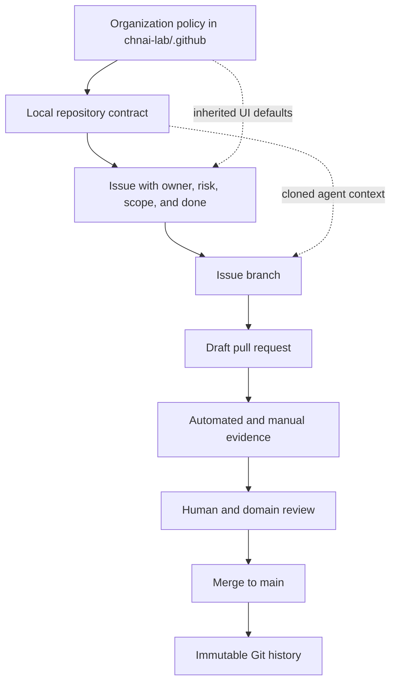

# Repository Standard

This is the adoption contract for every active CHNAI LAB product repository.
Repository-specific rules may be stricter, but they may not weaken security,
traceability, or human verification.

## Control Architecture

The public `.github` repository provides organization defaults in GitHub's UI,
but those files are not copied into private clones. Each product repository must
therefore keep a local `AGENTS.md` that points agents to this standard and states
the product-specific boundary.

## Required Files

| Path | Purpose |
| --- | --- |
| `README.md` | Product purpose, current stage, setup, and honest limitations |
| `AGENTS.md` | Agent entrypoint, read order, product boundary, commands, and stop rules |
| `CONTRIBUTING.md` | Human contribution and review workflow |
| `SECURITY.md` | Reporting route and sensitive-data boundary |
| `.github/CODEOWNERS` | Human review ownership with an owner fallback |
| `.github/workflows/ci.yml` | Repeatable policy, test, lint, and build checks appropriate to the repo |
| `.github/dependabot.yml` | GitHub Actions plus relevant package ecosystems |
| `.env.example` or equivalent | Placeholder-only configuration contract when environment values exist |
| Repo verifier or documented `verify` command | One command that checks the repository's required policy and engineering gates |

`CLAUDE.md`, Copilot instructions, or tool-specific files may extend
`AGENTS.md`; they do not replace the vendor-neutral entrypoint.

## Required Repository State

- `main` is the default branch.
- Repository visibility matches the public/private product boundary.
- Organization base access remains `none`.
- A product team has write access; direct collaborator grants are exceptional.
- `CODEOWNERS` names the product team and retains an organization-owner fallback.
- CI declares least-privilege permissions, job timeouts, pinned Action commit
  SHAs, and concurrency cancellation.
- Dependabot monitors Actions and relevant dependency manifests.
- No secret, private user data, customer data, private strategy, or production
  infrastructure detail is tracked.
- Generated output, caches, local agent state, and research assets are ignored
  unless a reviewed reason requires them.

## Adoption States

| State | Evidence | Meaning |
| --- | --- | --- |
| Context-ready | Required docs, local agent contract, safe environment template | A new human and agent can understand the repo without private coaching |
| Review-ready | Issue/PR templates, CODEOWNERS, CI, verifier, dependency monitoring | Work is traceable and reviewable |
| Enforced | Protected `main`, required checks, approval, conversation resolution | GitHub technically blocks policy bypass |

On GitHub Free, private product repos can reach Review-ready but not Enforced.
Do not mark them Enforced until the plan and live settings prove it.

## Risk-Sensitive Additions

Repositories add stricter controls when they touch:

- Authentication or authorization.
- Personal, farmer, buyer, student, customer, or employee data.
- Payments, financial reporting, trading, or signals.
- Security monitoring or incident response.
- AI output shown to users or used in decisions.
- Database migrations or production infrastructure.
- Khmer copy used with real users.

The local `AGENTS.md` states the specific forbidden actions, required reviewer,
test command, manual evidence, and rollback expectation.

## Adoption Procedure

1. Open a repository issue using the task form.
2. Record the current state and missing controls.
3. Create one `chore/<issue>-adopt-repo-standard` branch.
4. Add or repair required files without changing unrelated product behavior.
5. Run the repository verifier, tests, lint, build, and secret scan.
6. Open a draft pull request with the adoption checklist and AI involvement.
7. Have the product lead verify the product boundary and commands.
8. Merge, then record any GitHub-plan limitation as an explicit exception.

## Exception Contract

An exception must be written in the repository, linked to an issue, owned by a
human, justified by a real constraint, and given a review trigger. "The agent
could not make the check pass" is not an exception.

## Audit Questions

A recruiter, teammate, or automated reviewer should be able to answer from the
repository alone:

- What problem is this product addressing and what stage is it in?
- Which claims are proven, assumed, simulated, or not yet validated?
- How does a new agent obtain context?
- What command verifies the repository?
- Who reviews changes?
- What data and product boundaries must never be crossed?
- What remains a policy rather than a technically enforced control?
